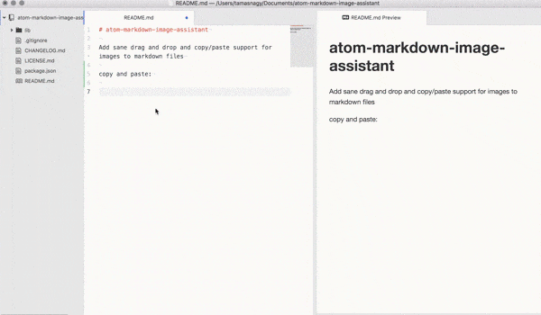

title:      Images and Video
desc:       Quick reference and showcase for different images and video style elements.
date:       2018/07/31
version:    1.0.0
template:   document
nav:        Demos>Images and Video
percent:    100
authors:    enq@heinventions.com


This is intended as a quick reference and showcase. For complete information on Markdown please see the [Python-Markdown](https://github.com/Python-Markdown/markdown) implementation.


If you are using the [Atom](https://atom.io/) editor, the [markdown-image-assistant](https://atom.io/packages/markdown-image-assistant) plugin will enable copy and paste images into the editor.
{: .tip}

# Images

A number of image styles and tags are supported.



Images are found in the relative path to the document. The format of an include is:

``.

**Avoid** using `` directly. Different image styles can be added by placing a `{: .classname}` on the line directly below an image include. The following are available:

```markdown
<!-- Example -->


<!-- A row of 3 images -->
{: .small}
{: .small}
{: .small}

<!-- Style classes can be combined. -->
{: .small .noborder}

<!-- We can put them in the middle. -->
{: .small .center}

<!-- Make them middle sized. -->
{: .medium}

<!-- The default is actual width up to a max height of the document flow, and no higher than a single A4 page. -->


<!-- The style class .large is the same as the default. -->
{: .large}

```

Unlike paragraphs, images are *inline* elements, so the style `{: style-class}` needs to be on the same line as the element.
{: .info}


This is an inline {: .icon} icon.

{: .small}
{: .small}
{: .small}

{: .small .noborder}

{: .small .center}

{: .medium}


{: .large}


# Videos

Videos can be inserted using the same technique as images.

```markdown
{: .small}

{: .medium}


```

<!-- Videos are *block* elements, so the style `{: style-class}` needs to be on the line below the element.
{: .info} -->

Supported formats include: `.ogv`, `.ogg`, `webm`, `mp4`, and in some browsers `avi`.
{: .info}

{: .small}

{: .medium}


# YouTube

YouTube videos can also be embed into the document directly with the normal image and link format.

```markdown
{: .small}

{: .medium}


```

{: .small}

{: .medium}


# PDF

PDF documents can be displayed too. You can add a `{: .landscape}` property to these in order to change the aspect ratio. Only the `A4` paper aspect is currently supported.

```markdown


{: .landscape}

```


{: .landscape}
