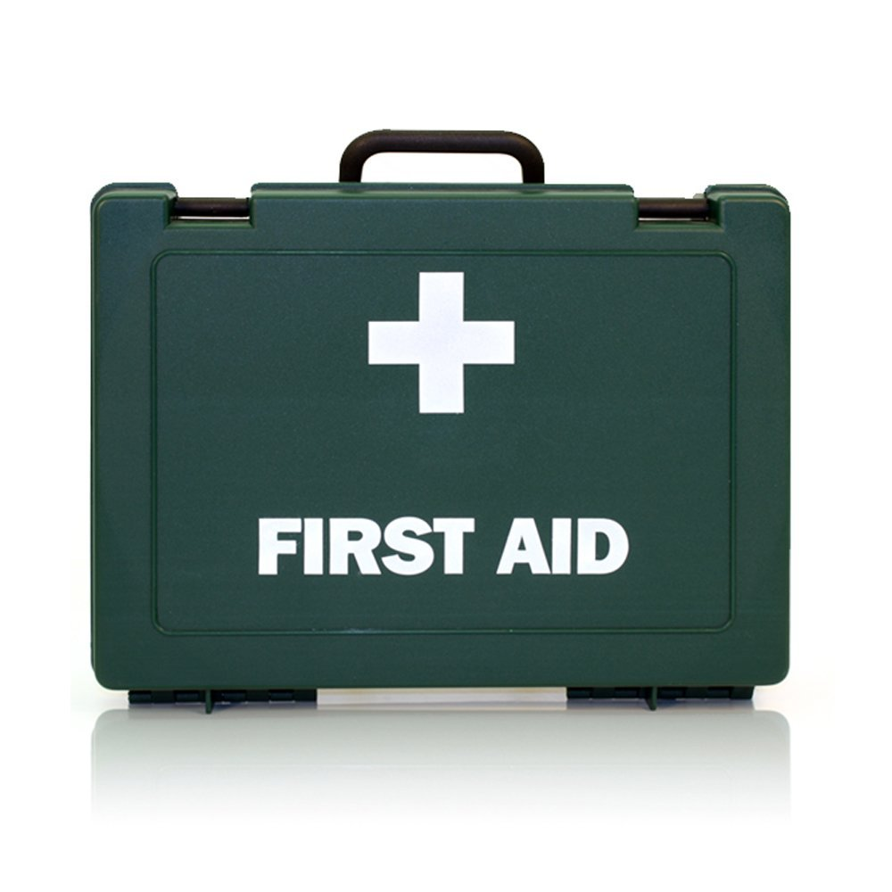

title:      Workplace First Aid Kit
desc:       Crest Medical 10 Person HSE Workplace First Aid Kit
template:   part
nav:        Items>Medical Kit
percent:    100
pbs:        B0076PGVPU
reference:  https://www.amazon.co.uk/gp/product/B0076PGVPU
facts:      weight=660g
            Persons=10
            Compliant=CE, HSE
version:    1.0.2
history:    1.0.1; 2018/08/15; enq@heinventions.com; Added first paragraph.
            1.0.2; 2018/08/16; enq@heinventions.com; Added second paragraph.

# Product Description

First aid kit in durable plastic box with carrying handle. Suitable for areas with upto 10 people employed with low risk.

# Specification

* **20x** Assorted Washproof Plasters;
* **2x** Sterile Eyepads with bandages;
* **4x** Non-woven triangular bandages;
* **6x** Safety pins;
* **6x** Medium 12cm x 12cm sterile dressings;
* **2x** Large 18cm x 18cm sterile dressings;
* **10x** Alcohol-free hygienic cleansing wipes;
* **1x** Pair of Powder-free Vinyl gloves;
* **1x** First Aid administration guidance leaflet

# Images

{: .medium}
