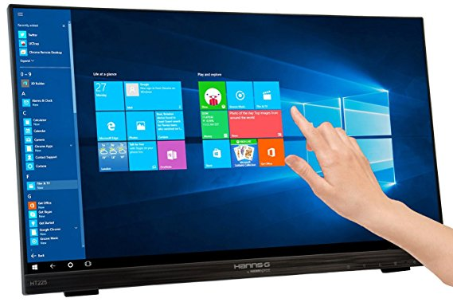
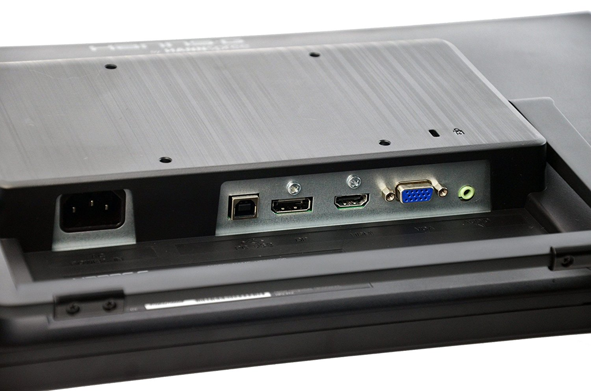
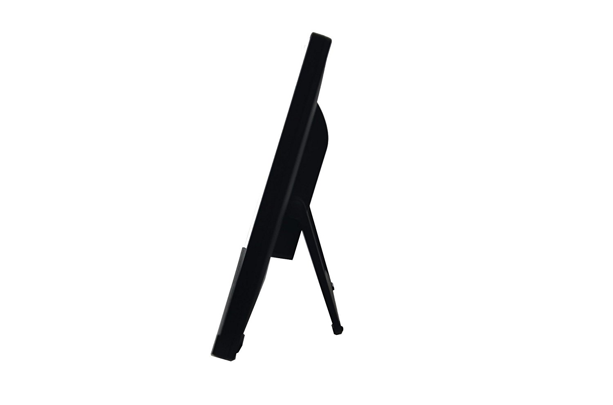

title:      Touch Screen 21.5"
desc:       Hanns.G HT225HPB 21.5" LED Multi-Touch Screen
template:   part
nav:        Items>Touch Screen
percent:    10
pbs:        HE0000001
reference:  https://www.amazon.co.uk/gp/product/B01F3636V0
facts:      voltage=230V
            wattage=4W
            weight=4.68Kg
            colour=Black
version:    1.0.2
history:    1.0.1; 2018/08/15; enq@heinventions.com; Added first paragraph.
            1.0.2; 2018/08/16; enq@heinventions.com; Added second paragraph.

# Product Description

With `1920x1080` Full HD resolution and Projective Capacitive 10 point touch technology the HANNSpree `HT225HPB` delivers seamless and accurate touch response.

Featuring Ultra-Wide Viewing Angle LED-backlight LCD screen technology, it offers exceptional colour performance and wide viewing angles.

# Specification

Brand name
:   Hanns G

Item Weight
:   4.68 Kg

Product Dimensions
:   4.8 x 49 x 29.9 cm

Item model number
:   V320169

Series
:   HT225HPB

Color
:   Black

Screen Size
:   21.5 inches

Screen Resolution
:   1920 x 1080 pixels

Display Resolution
:   1080p Full HD

Processor Count
:   1

Computer Memory Type
:   DDR3 SDRAM

Speaker Description
:   Loudspeakers

Number of HDMI Ports
:   1

Number of VGA Ports
:   1

Wattage
:   4 watts

# Images

{: .small} {: .small} {: .small}
