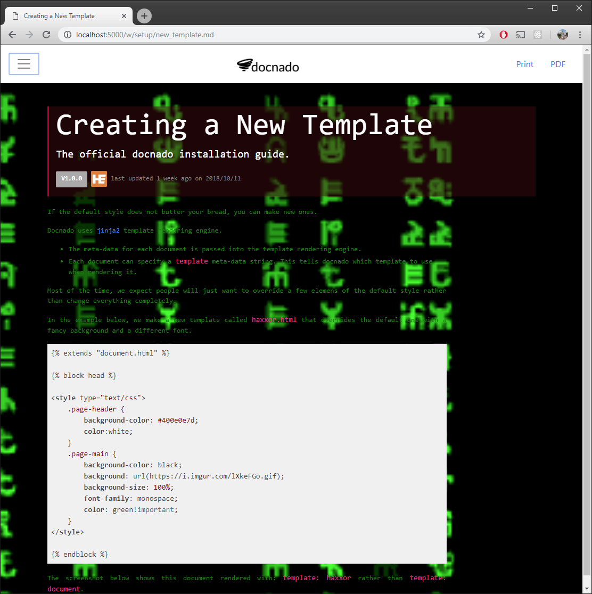

title:      Creating a New Template
desc:       The official docnado installation guide.
date:       2018/10/11
version:    1.0.0
template:   document
nav:        Get Setup>New Template
percent:    100
authors:    enq@heinventions.com

If the default style does not butter your bread, you can make new ones.

Docnado uses [jinja2](http://jinja.pocoo.org/docs/2.10/) template rendering engine.

* The meta-data for each document is passed into the template rendering engine.
* Each document can specify a `template` meta-data string. This tells docnado which template to use when rendering it.

Most of the time, we expect people will just want to override a few elemens of the default style rather than change everything completely.

In the example below, we make a new template called `haxxor.html` that overrides the default one with a fancy background and a different font.

```




<style type="text/css">
    .page-header {
        background-color: #400e0e7d;
        color:white;
    }
    .page-main {
        background-color: black;
        background: url(https://i.imgur.com/lXkeFGo.gif);
        background-size: 100%;
        font-family: monospace;
        color: green!important;
    }
</style>


```

The screenshot below shows this document rendered with: `template:   haxxor` rather than `template:   document`.


